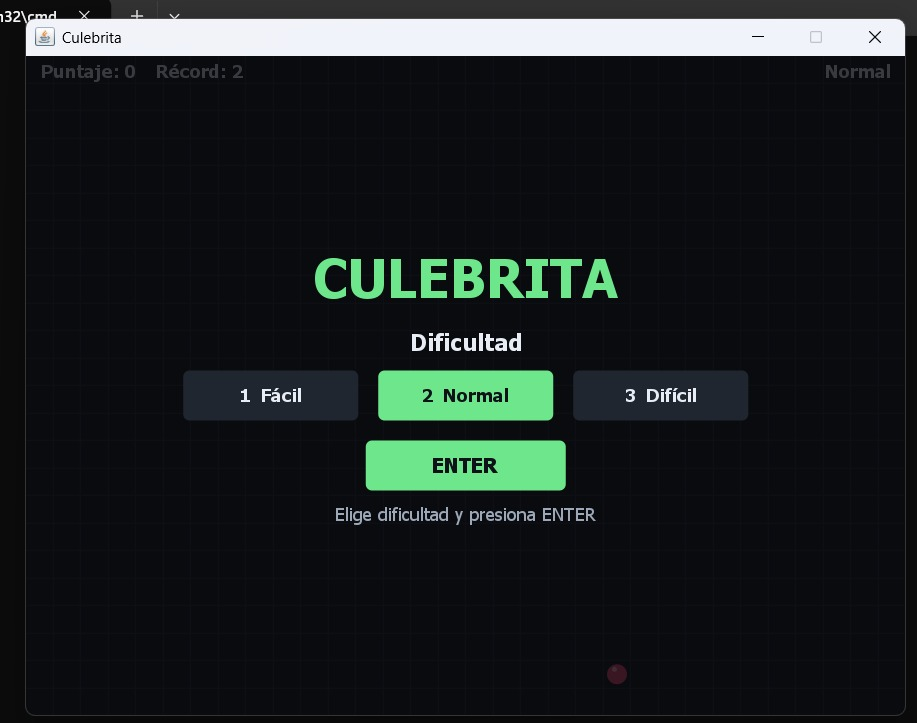
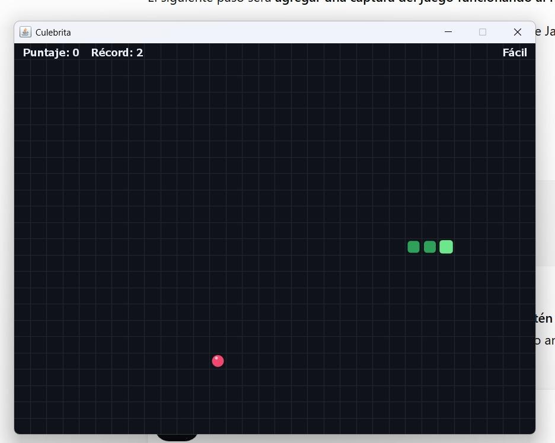
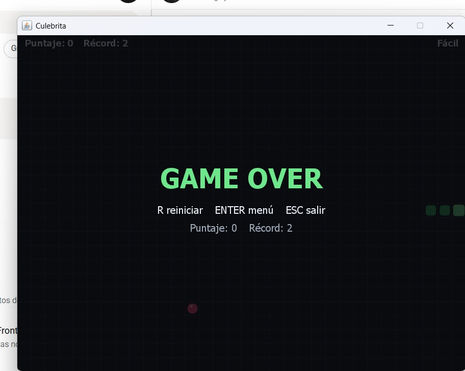

# Culebrita

Juego clásico tipo **Snake** desarrollado en **Java** utilizando **Swing**.

La aplicación permite controlar una serpiente sobre una cuadrícula, consumir comida,
aumentar su longitud y obtener puntos. La partida termina al producirse una colisión
con los límites del tablero o con el propio cuerpo de la serpiente.

## Funcionalidades principales

- **Movimiento de la serpiente:** desplazamiento por una cuadrícula mediante teclado.
- **Crecimiento:** la serpiente aumenta su longitud al consumir comida.
- **Generación aleatoria de comida:** la comida se genera en una celda libre del tablero.
- **Detección de colisiones:** control de colisiones contra los bordes y el propio cuerpo.
- **Prevención de giro de 180°:** se bloquean cambios de dirección directamente opuestos.
- **Sistema de puntuación:** se registra el puntaje de la partida actual.
- **Récord persistente:** el mejor puntaje se conserva entre ejecuciones mediante
  `java.util.prefs.Preferences`.
- **Tres niveles de dificultad:** Fácil, Normal y Difícil.
- **Velocidad progresiva:** la velocidad aumenta cada 5 puntos hasta alcanzar
  un límite mínimo según la dificultad.
- **Pausa:** permite pausar y reanudar la partida.
- **Reinicio:** permite iniciar una nueva partida sin cerrar la aplicación.
- **Menú inicial:** permite seleccionar la dificultad antes de comenzar.
- **Game Over:** muestra el estado de finalización cuando ocurre una colisión.
- **Victoria:** la partida finaliza cuando la serpiente ocupa todas las celdas disponibles.
- **Interfaz gráfica:** tablero, serpiente, comida, puntaje, récord y estados del juego
  renderizados mediante Java Swing.

## Controles

| Tecla | Acción |
|---|---|
| `1` / `NumPad 1` | Seleccionar dificultad Fácil |
| `2` / `NumPad 2` | Seleccionar dificultad Normal |
| `3` / `NumPad 3` | Seleccionar dificultad Difícil |
| `←` / `A` | Mover a la izquierda |
| `→` / `D` | Mover a la derecha |
| `↑` / `W` | Mover hacia arriba |
| `↓` / `S` | Mover hacia abajo |
| `P` / `Espacio` | Pausar / continuar |
| `R` | Reiniciar partida |
| `ENTER` | Iniciar / volver al menú |
| `ESC` | Salir / volver al menú |

## Dificultades

El juego cuenta con tres niveles de dificultad:

| Nivel | Velocidad inicial | Velocidad mínima |
|---|---:|---:|
| Fácil | 160 ms | 50 ms |
| Normal | 110 ms | 40 ms |
| Difícil | 70 ms | 30 ms |

La velocidad se incrementa progresivamente cada 5 puntos, reduciendo el intervalo
de actualización hasta alcanzar el límite mínimo definido para cada dificultad.

## Arquitectura

El proyecto utiliza una separación de responsabilidades entre el modelo,
la interfaz gráfica y la persistencia de datos.

```text

src/main/java/culebrita/

├── model/
│   ├── Cell.java
│   ├── Difficulty.java
│   ├── Direction.java
│   ├── Game.java
│   ├── GamePhase.java
│   ├── ScoreRepository.java
│   └── Snake.java
│
├── ui/
│   ├── GameFrame.java
│   └── GamePanel.java
│
├── persist/
│   └── PreferenceScoreRepository.java
│
└── CulebritaApp.java
```

## Capturas del juego

### Menú principal



El menú permite seleccionar entre los niveles de dificultad Fácil, Normal y Difícil
antes de iniciar la partida.

### Partida en ejecución



Durante la partida se muestran el tablero, la serpiente, la comida, el puntaje,
el récord y la dificultad seleccionada.

### Game Over



Al producirse una colisión se muestra el estado Game Over, el puntaje obtenido,
el récord y las opciones disponibles para reiniciar, volver al menú o salir.

## Pruebas automatizadas

El proyecto utiliza **JUnit 5** para validar diferentes aspectos de la lógica
del juego.

Las pruebas incluyen:

- Estado inicial de la partida.
- Longitud inicial de la serpiente.
- Bloqueo del giro de 180°.
- Colisión con los bordes del tablero.
- Crecimiento de la serpiente al consumir comida.
- Incremento del puntaje.
- Actualización del récord.
- Generación de comida fuera del cuerpo de la serpiente.

## Tecnologías

- **Java 11+**
- **Java Swing**
- **Maven**
- **JUnit 5**
- `ArrayDeque`
- `ArrayList`
- `java.util.prefs.Preferences`
- `javax.swing.Timer`

## Requisitos

- **JDK 11 o superior**
- **Maven** para ejecutar las pruebas y construir el proyecto.

## Ejecución

### Windows

El proyecto incluye un script de ejecución:

```bat
run.bat
```

### Maven

Ejecutar las pruebas:

```bash
mvn test
```

Construir el proyecto:

```bash
mvn package
```

Ejecutar el archivo `.jar` generado:

```bash
java -jar target/culebrita-1.0.0.jar
```

## Estructura del proyecto

```text
culebrita-java/
│
├── src/
│   ├── main/
│   │   └── java/
│   │       └── culebrita/
│   │           ├── model/
│   │           ├── persist/
│   │           ├── ui/
│   │           └── CulebritaApp.java
│   │
│   └── test/
│       └── java/
│           └── culebrita/
│               └── model/
│                   └── GameTest.java
│
├── screenshots/
│   ├── menu.jpeg
│   ├── game-play.jpeg
│   └── game-over.jpeg
│
├── .gitignore
├── LICENSE
├── pom.xml
├── README.md
└── run.bat
```

## Autor

**Luis Felipe Correa Martínez**

Proyecto desarrollado como práctica de programación en Java.
